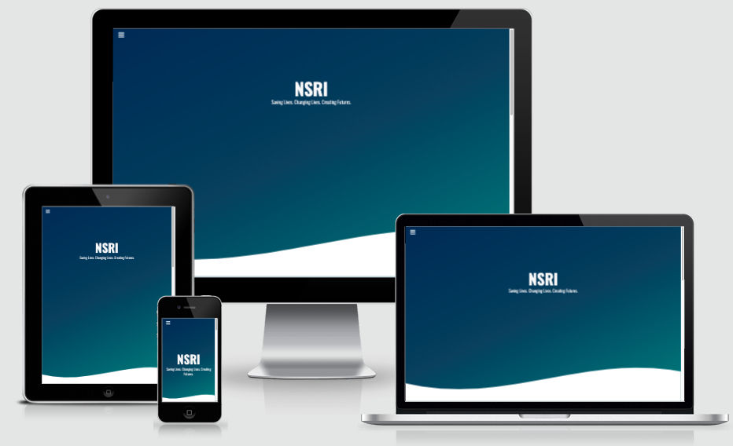

# freeCodeCamp Responsive Web Design Project 1: Tribute to NSRI

 

This is a solution to the [Responsive Web Design Project 1 on freeCodeCamp](https://www.freecodecamp.org/learn/responsive-web-design/responsive-web-design-projects/build-a-tribute-page). This project is one of 5 projects to complete my Responsive Web Design Certification.

## Table of contents

- [Overview](#overview)
  - [The challenge](#the-challenge)
  - [Screenshot](#screenshot)
  - [Links](#links)
- [My process](#my-process)
  - [Built with](#built-with)
  - [What I learned](#what-i-learned)
- [Author](#author)

## Overview

### The challenge
- Build a Tribute Page. You can use HTML, JavaScript, and CSS to complete this project. 
- I decided to create a tribute page for the National Sea Rescue Institute (NSRI)

#### User Stories (Minimum tasks to be completed)
1. My tribute page should have an element with a corresponding id="main", which contains all other elements.
2. I should see an element with a corresponding id="title", which contains a string (i.e. text) that describes the subject of the tribute page (e.g. "Dr. Norman Borlaug").
3. I should see a div element with a corresponding id="img-div".
4. Within the img-div element, I should see an img element with a corresponding id="image".
5. Within the img-div element, I should see an element with a corresponding id="img-caption" that contains textual content describing the image shown in img-div.
6. I should see an element with a corresponding id="tribute-info", which contains textual content describing the subject of the tribute page.
7. I should see an a element with a corresponding id="tribute-link", which links to an outside site that contains additional information about the subject of the tribute page. HINT: You must give your element an attribute of target and set it to _blank in order for your link to open in a new tab (i.e. target="_blank").
8. The img element should responsively resize, relative to the width of its parent element, without exceeding its original size.
9. The img element should be centered within its parent element.

### Screenshots
#### Mobile
- [Mobile image 1](assets/design/mobile-screenshot-1.png)
- [Mobile image 2](assets/design/mobile-screenshot-2.png)
#### Desktop
- [Desktop image 1](assets/design/desktop-screenshot-1.png)
- [Desktop image 2](assets/design/desktop-screenshot-2.png)

### Links

- [Repo](https://github.com/Franciskadtt/tributeNSRI)
- [Live site](https://franciskadtt.github.io/tributeNSRI/)

## My process

### UX Design
1. Understand the goal (WHY) - Need to design & build website with certain parameters. 
2. Define the audience (WHAT) - Person interested to see a tribute on someone/something/organisation/cause.
3. Understand the context and customer needs (WHEN and WHERE) - It should be visual and factual
4. List ideas (WHAT) 
5. Prioritise and choose an idea - Tribute to NSRI
6. Solve:
    - Research
    - Define 
    - Design
    - Build 
    - Test

### Built with
- HMTL
- CSS 
- Javascript
- Bootstrap

### What I learned

- How to create svg waves with CSS
- How to use gradients with CSS
- Hidden Side navbar with Javascript

## Author

- Website - [Franciska Du Toit](https://franciskadutoit.com/)
- Instagram - [@
designed.byfranciska
](https://www.instagram.com/designed.byfranciska/)
- Github - [@franciskadtt](https://github.com/Franciskadtt)

## Credit

### Content
- [NSRI](https://www.nsri.org.za/)
- [Wikipedia](https://en.wikipedia.org/wiki/National_Sea_Rescue_Institute)

### Photos 
- [SeaRescue Flickr](https://www.flickr.com/photos/searescue/)
